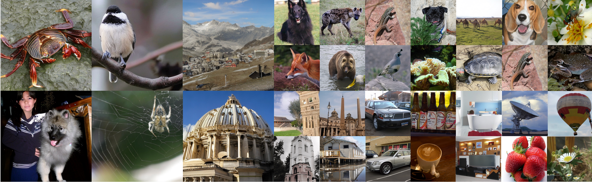
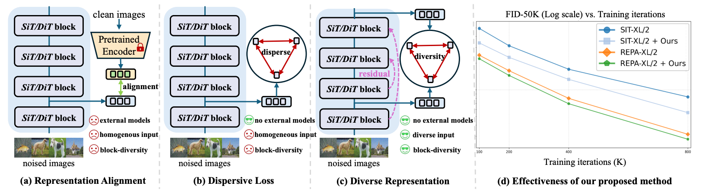
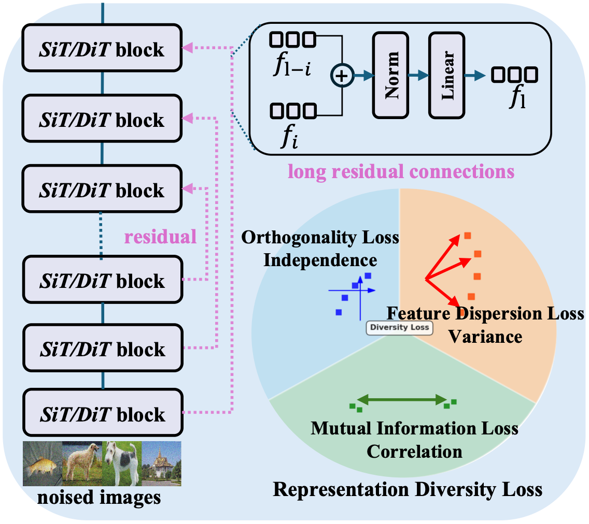

<div align="center">
<h1>DiverseDiT: Towards Diverse Representation Learning in Diffusion Transformers</h1>

[Mengping Yang](kobeshegu.github.io)<sup>1,2</sup> [Zhiyu Tan](https://openreview.net/profile?id=~Zhiyu_Tan1)<sup>1,2</sup> [Binglei Li](https://openreview.net/profile?id=~Binglei_Li1)<sup>1,2,3</sup> [Xiaomeng Yang](https://openreview.net/profile?id=~xiaomeng_yang3)<sup>1</sup> [Hesen Chen](https://openreview.net/profile?id=~Hesen_Chen1)<sup>1,2</sup> [Hao Li](https://scholar.google.com.hk/citations?user=pHN-QIwAAAAJ&hl=en)<sup>2,1,3</sup> 


<sup>1</sup>Shanghai Academy of AI for Science &emsp; <sup>2</sup>Fudan University  &emsp; <sup>3</sup>Shanghai Innovation Institute

[🌐 Project page](https://forevermamba.work/projects/DiverseDiT/) &ensp; [📄 Research Paper](https://arxiv.org/abs/2603.04239)

</div>

 

> **TL; DR:**  We propose ***DiverseDiT***, a novel framework that explicitly promotes representation diversity: (a) REPA employs external encoders as guidance and different blocks' inputs are homogeneous. (b) DispLoss encourage internal representations to spread out but still with homogeneous input and without block-wise diversity. (c) We propose long residual connections to enhance input diversity and diversity loss to encourage diverse feature representations across blocks.

 


## Abstract 
Recent breakthroughs in Diffusion Transformers (DiTs) have revolutionized the field of visual synthesis due to their superior scalability. To facilitate DiTs’ capability of capturing meaningful internal representations, recent works such as REPA incorporate external pretrained encoders for representation alignment. However, the underlying mechanisms governing representation learning within DiTs are not well understood. To this end, we first systematically investigate the representation dynamics of DiTs. Through analyzing the evolution and influence of internal representations under various settings, we reveal that representation diversity across blocks is a crucial factor for effective learning. Based on this key insight, we propose DiverseDiT, a novel framework that explicitly promotes representation diversity. DiverseDiT incorporates long residual connections to diversify input representations across blocks and a representation diversity loss to encourage blocks to learn distinct features. Extensive experiments on ImageNet 256 × 256 and 512 × 512 demonstrate that our DiverseDiT yields consistent performance gains and convergence acceleration when applied to different backbones with various sizes, even when tested on the challenging one-step generation setting. Furthermore, we show that DiverseDiT is complementary to existing representation learning techniques, leading to further performance gains. Our work provides valuable insights into the representation learning dynamics of DiTs and offers a practical approach for enhancing their performance.

 


## TODOs

- [✅] Release paper and project page
- [ ] Release probing code (within two weeks)
- [ ] Training code verification (within two weeks)
- [ ] Pretrained weights (within two weeks)


 ## Setup 

 Run the following script to setup environment.

 ```bash
git clone https://github.com/kobeshegu/DiverseDiT.git
cd DiverseDiT
conda env create -f environment.yml
conda activate DiverseDiT
```

## Training With DiverseDiT

## Sampling

## Evaluation


## License
This project is under the MIT license. See [LICENSE](LICENSE.txt) for details.

## BibTeX


```bibtex
@misc{yang2025diversedit,
  title        = {DiverseDiT: Towards Diverse Representation Learning in Diffusion Transformers},
  author       = {Mengping Yang and Zhiyu Tan and Binglei Li and Xiaomeng Yang and Hesen Chen and Hao Li},
  year         = {2026},
  archivePrefix= {arXiv},
  primaryClass = {cs.CV}
}
```

## Acknowledgements

This codebase builds upon the following excellent works:
- [SiT](https://github.com/willisma/SiT) - Scalable Interpolant Transformers
- [REPA](https://github.com/sihyun-yu/REPA) - Representation Alignment
- [DispLoss](https://github.com/raywang4/DispLoss) - Dispersive Regularization
