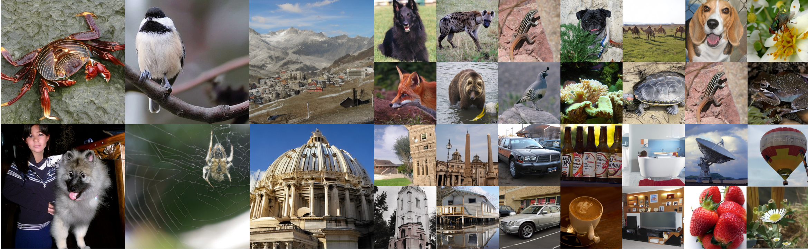
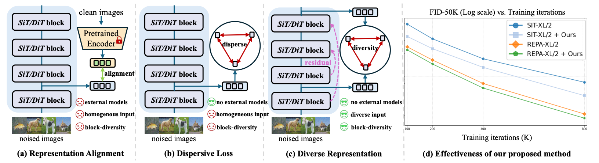
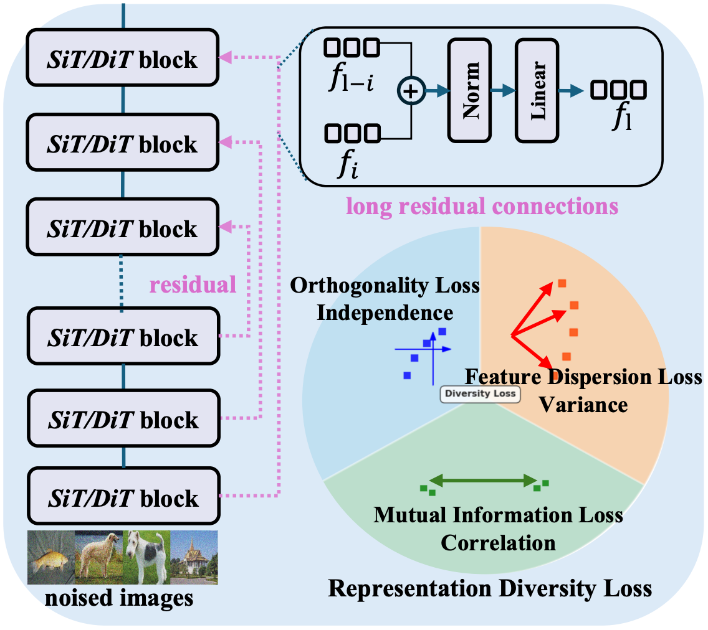

<div align="center">
<h1>DiverseDiT: Towards Diverse Representation Learning in Diffusion Transformers</h1>

[Mengping Yang](kobeshegu.github.io)<sup>1,2</sup> [Zhiyu Tan](https://openreview.net/profile?id=~Zhiyu_Tan1)<sup>1,2</sup> [Binglei Li](https://openreview.net/profile?id=~Binglei_Li1)<sup>1,2,3</sup> [Xiaomeng Yang](https://openreview.net/profile?id=~xiaomeng_yang3)<sup>1</sup> [Hesen Chen](https://openreview.net/profile?id=~Hesen_Chen1)<sup>1,2</sup> [Hao Li](https://scholar.google.com.hk/citations?user=pHN-QIwAAAAJ&hl=en)<sup>2,1,3</sup> 


<sup>1</sup>Shanghai Academy of AI for Science &emsp; <sup>2</sup>Fudan University  &emsp; <sup>3</sup>Shanghai Innovation Institute

[🌐 Project page](https://forevermamba.work/projects/DiverseDiT/) &ensp; [📄 Research Paper](https://arxiv.org/abs/2603.04239)

</div>

 

> **TL; DR:**  We propose ***DiverseDiT***, a novel framework that explicitly promotes representation diversity: (a) REPA employs external encoders as guidance and different blocks' inputs are homogeneous. (b) DispLoss encourage internal representations to spread out but still with homogeneous input and without block-wise diversity. (c) We propose long residual connections to enhance input diversity and diversity loss to encourage diverse feature representations across blocks.

 


## Abstract 
Recent breakthroughs in Diffusion Transformers (DiTs) have revolutionized the field of visual synthesis due to their superior scalability. To facilitate DiTs’ capability of capturing meaningful internal representations, recent works such as REPA incorporate external pretrained encoders for representation alignment. However, the underlying mechanisms governing representation learning within DiTs are not well understood. To this end, we first systematically investigate the representation dynamics of DiTs. Through analyzing the evolution and influence of internal representations under various settings, we reveal that representation diversity across blocks is a crucial factor for effective learning. Based on this key insight, we propose DiverseDiT, a novel framework that explicitly promotes representation diversity. DiverseDiT incorporates long residual connections to diversify input representations across blocks and a representation diversity loss to encourage blocks to learn distinct features. Extensive experiments on ImageNet 256 × 256 and 512 × 512 demonstrate that our DiverseDiT yields consistent performance gains and convergence acceleration when applied to different backbones with various sizes, even when tested on the challenging one-step generation setting. Furthermore, we show that DiverseDiT is complementary to existing representation learning techniques, leading to further performance gains. Our work provides valuable insights into the representation learning dynamics of DiTs and offers a practical approach for enhancing their performance.

 


## TODOs

- [✅] Release paper and project page
- [✅] Release training code
- [✅] Training code verification
- [ ] Pretrained weights


 ## Setup 

 Run the following script to setup environment.

 ```bash
git clone https://github.com/kobeshegu/DiverseDiT.git
cd DiverseDiT
conda env create -f environment.yml
conda activate DiverseDiT
```

## Usage

### Dataset

#### Dataset download

We run class-conditional experiments on [ImageNet](https://www.kaggle.com/competitions/imagenet-object-localization-challenge/data). Put the preprocessed data anywhere on disk and pass the root directory to training via `--data-dir`. For latent packing, resizing, and 512×512 VAE latents, follow the same preprocessing pipeline as [REPA](https://github.com/sihyun-yu/REPA/tree/master/preprocessing); this repo also includes a local `preprocessing/` directory you can adapt.

Training loads a Stable Diffusion VAE from disk: set `--pretrained-model-path` to a directory that contains `sd-vae-ft-mse` or `sd-vae-ft-ema` (matching `diffusers` / `stabilityai/sd-vae-ft-*` layouts), consistent with `--vae`.

### ImageNet 256×256

See the exp.sh in ./scripts for automatic pipeline for training, generation, and evaluation, specifically:

```bash
accelerate launch train.py \
  --report-to="wandb" \
  --allow-tf32 \
  --mixed-precision="fp16" \
  --seed=0 \
  --path-type="linear" \
  --prediction="v" \
  --weighting="uniform" \
  --model="SiT-XL/2" \
  --enc-type="dinov2-vit-b" \
  --proj-coeff=0.5 \
  --encoder-depth=8 \
  --output-dir="exps" \
  --exp-name="diversedit-linear-dinov2-b-enc8" \
  --data-dir=[YOUR_DATA_PATH] \
  --pretrained-model-path=[YOUR_PRETRAINED_MODEL_PATH] \
  --skip-layer-connection \
  --block-diversity-loss \
```

**DiverseDiT options** (optional):

- `--skip-layer-connection`: long skip connections for more diverse per-block inputs.
- `--block-diversity-loss`: enable the representation diversity loss.

Other knobs you may want to change:

- `--model`: e.g. `SiT-B/2`, `SiT-L/2`, `SiT-XL/2`.
- `--enc-type`: comma-separated list of encoders in the `type-arch-size` style used by `utils.load_encoders` (e.g. `dinov2-vit-b`). Note that at `--resolution 512`, only DINOv2-style encoders are supported in code.
- `--proj-coeff`: REPA projection loss weight (\> 0).
- `--encoder-depth`: number of global transformer layers used for the encoder branch (1 … depth of the SiT).
- `--output-dir`, `--exp-name`: experiment root and run name.
- `--pretrained-model-path`, `--vae`: VAE root and `mse` vs `ema`.
- `--projection`, whether to perform repa-like projection.

**Encoder weights.** DINOv2, CLIP, MoCo v3, DINOv1, I-JEPA, and MAE paths are resolved under `./ckpts/` as in REPA/SiT-style setups (for example `dinov2_vitb.pth`, `dinov1_vitb.pth`, `mocov3_vitb.pth`, `ijepa_vith.pth`, `mae_vitl.pth`). Obtain checkpoints from the official [DINO](https://github.com/facebookresearch/dino), [DINOv2](https://github.com/facebookresearch/dinov2), [RCG / MoCo v3](https://github.com/LTH14/rcg), [I-JEPA](https://github.com/facebookresearch/ijepa), [MAE](https://github.com/facebookresearch/mae), and CLIP as needed.


## Sampling

Distributed sampling writes PNGs under `{sample-dir}/{run-name}/images`. Build an `.npz` for ADM-style metrics with `npz_convert.py` (see **Evaluation**).

Class-conditional ImageNet example:

```bash
torchrun --nnodes=1 --nproc_per_node=8 generate.py \
  --model SiT-XL/2 \
  --num-fid-samples 50000 \
  --ckpt [YOUR_CHECKPOINT_PATH] \
  --path-type=linear \
  --encoder-depth=8 \
  --projector-embed-dims=768 \
  --per-proc-batch-size=64 \
  --mode=sde \
  --num-steps=250 \
  --cfg-scale=1.8 \
  --guidance-high=0.7 \
  --resolution=256 \
  --pretrained-model-path=[YOUR_PRETRAINED_MODEL_PATH] \
  --skip-layer-connection \
  --block-diversity-loss \
```

Match training architecture when sampling: if you trained with `--skip-layer-connection` and/or `--block-diversity-loss`, pass the same flags to `generate.py`. Set `--projector-embed-dims` to a comma-separated list whose length matches the number of encoders (one dimension per encoder). If `--ckpt` is omitted and you keep the defaults expected by `generate.py`, a reference checkpoint may be downloaded automatically (see `utils.download_model`).


For MS-COCO text-to-image, use `generate_t2i.py` with a checkpoint produced by `train_t2i.py`.

## Evaluation

We follow the [ADM evaluation](https://github.com/openai/guided-diffusion/tree/main/evaluations) protocol using a single `.npz` of uint8 RGB samples. After sampling, pack the image folder into `.npz` (adjust paths to match your `generate.py` output layout):

```bash
python npz_convert.py \
  --sample-dir=samples \
  --ckpt=[YOUR_CHECKPOINT_PATH] \
  --num-fid-samples=50000 \
  --resolution=256 \
  --vae=mse \
  --cfg-scale=1.8 \
  --global-seed=0 \
  --mode=sde
```

Point `npz_convert.py` at the `.../images` directory implied by `--sample-dir` and the run folder name it constructs from `--ckpt` and the other flags (see `npz_convert.py` for the exact naming pattern). Then, computing the quantitative results with evaluatioor.py, and the results will be automatically saved in your_path_here/your_experiment_name.txt

```
python evaluator.py \
 your_path_here/VIRTUAL_imagenet256_labeled.npz \
 your_path_here/your_experiment_name.npz
```


**Note.** Public releases can diverge slightly from paper numbers because of data and cleanup differences. If anything fails to reproduce, please open an issue with your command line and environment.

## License
This project is under the MIT license. See [LICENSE](LICENSE.txt) for details.

## BibTeX


```bibtex
@misc{yang2025diversedit,
  title        = {DiverseDiT: Towards Diverse Representation Learning in Diffusion Transformers},
  author       = {Mengping Yang and Zhiyu Tan and Binglei Li and Xiaomeng Yang and Hesen Chen and Hao Li},
  year         = {2026},
  archivePrefix= {arXiv},
  primaryClass = {cs.CV}
}
```

## Acknowledgements

This codebase builds upon the following excellent works:
- [SiT](https://github.com/willisma/SiT) - Scalable Interpolant Transformers
- [REPA](https://github.com/sihyun-yu/REPA) - Representation Alignment
- [DispLoss](https://github.com/raywang4/DispLoss) - Dispersive Regularization
- [UViT](https://arxiv.org/abs/2209.12152)
- [SkipDiT](https://arxiv.org/abs/2411.17616)
